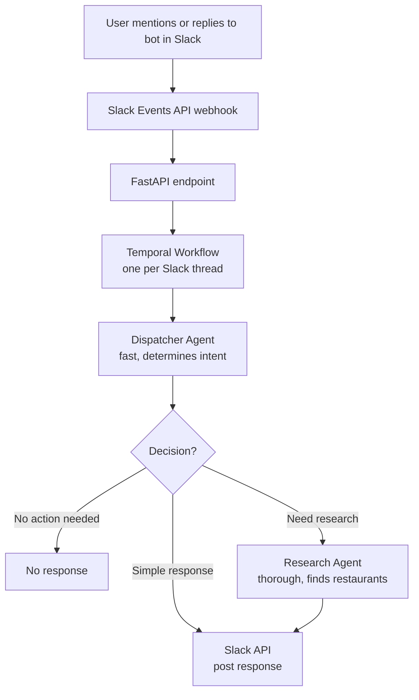

# Building Durable AI Agents with PydanticAI and Temporal: A Slack Bot Case Study

## Introduction

Building reliable AI applications is hard.
Between managing API failures, handling long-running operations, coordinating multiple AI agents, and maintaining conversation state, there's a lot that can go wrong.
When you add human-in-the-loop workflows where users need to provide additional information or approve actions, the complexity grows even further.

This article demonstrates how to combine [PydanticAI](https://ai.pydantic.dev/) and [Temporal](https://temporal.io/) to build production-ready AI applications.
We'll walk through building a Slack bot that helps users decide what to order for dinner — a deliberately low-stakes use case that still showcases powerful patterns you can apply to more critical applications.

Why a Slack bot for dinner recommendations? Several reasons:
- **Human-in-the-loop demonstration**: Natural use case for partial information and iterative refinement—a real-world scenario where AI follow-up questions feel organic, showcasing Temporal's signal handling
- **No UI needed**: Slack provides the interface, letting us focus on the AI orchestration
- **Easy to deploy**: [ngrok](https://ngrok.com) makes local development painless, and Slack's API and UI make it easy to develop and debug
- **Practical foundation**: The patterns here easily adapt to other Slack bots that could generate real value for your team
- **Fun and useful**: Light-hearted enough to be enjoyable to work on, but practical enough that I actually use it!

## Why This Stack?

### PydanticAI
PydanticAI brings type safety and structure to AI development. Instead of parsing free-text LLM outputs and hoping for the best, you define Pydantic models for your expected outputs and let the framework handle the rest. You get:
- **Type-safe outputs**: Define exactly what shape you want your AI responses to take
- **Structured tool calling**: Clean abstractions for giving your agents access to external tools
- **Model agnostic**: Swap between providers without changing your code

### Temporal
Temporal provides durable execution for your workflows. When your dinner recommendation agent is halfway through researching restaurants and your server crashes, Temporal picks up right where it left off. You get:
- **Durability**: Workflows survive server restarts, network failures, and other interruptions
- **Built-in state management**: No need for external databases to track conversation state
- **Signal handling**: Perfect for human-in-the-loop workflows where users provide information asynchronously

### Better Together
Combining these tools gives you AI applications that are both intelligent and reliable. PydanticAI handles the AI complexity while Temporal handles the fault tolerance and distributed systems complexity, leaving you to focus on your business logic.

## Architecture Overview

Our application follows this flow:



### Key Design Decisions

**Thread-based workflows**: Each Slack thread gets its own Temporal workflow that persists for the conversation's lifetime. This contrasts with stateless approaches where you'd retrieve the entire thread history and reprocess it on each message. The workflow approach gives us:
- **Efficiency**: We only process new messages, not the entire history
- **State management**: The workflow naturally maintains conversation context
- **Future extensibility**: Could easily evolve to entity workflows that track user preferences across conversations

**Multi-agent architecture**: We use a two-agent system:
1. A fast, lightweight dispatcher agent that determines what the user wants
2. A more capable research agent that does the heavy lifting when needed

This saves costs and reduces latency for simple interactions while still providing thorough responses when needed.

## Building the Dispatcher Agent

Our dispatcher agent acts as the first line of response. It determines whether to:
1. Do nothing (users talking among themselves)
2. Respond immediately (clarifying questions, simple responses)
3. Delegate to the dinner research agent (when we have enough information)

Here's the implementation:

```python
from dataclasses import dataclass
from typing import Literal
from pydantic import with_config
from pydantic_ai import Agent

@dataclass
@with_config(use_attribute_docstrings=True)
class NoResponse:
    """Indicates no response needed - users are talking among themselves."""
    type: Literal["no-response"]

@dataclass
@with_config(use_attribute_docstrings=True)
class SlackResponse:
    """Send an immediate response without research."""
    type: Literal["slack-response"]
    response: str | list[dict[str, Any]]

@dataclass
@with_config(use_attribute_docstrings=True)
class DinnerOptionResearchRequest:
    """Delegate to the research agent."""
    type: Literal["dinner-option-research-request"]
    location: str
    cuisine_preferences: str
    dietary_restrictions: str
    price_preferences: str

dispatcher_agent = Agent(
    model="openai-responses:gpt-5-mini",  # Fast, cheap model
    output_type=[NoResponse, SlackResponse, DinnerOptionResearchRequest],
    instructions="""
    You help users decide what to order for dinner.

    - If users are talking among themselves, return NoResponse
    - If you need more information, return SlackResponse with questions
    - If you have enough information, return DinnerOptionResearchRequest

    Don't guess preferences - always ask if unsure.
    """
)
```

The structured output types ensure the agent can only return one of our predefined response types. No parsing, no hoping the LLM follows instructions — just type-safe outputs.

## Implementing the Research Agent

When the dispatcher agent decides we have enough information, the research agent takes over:

```python
from dataclasses import dataclass
from pydantic_ai import Agent
from pydantic_ai.common_tools.duckduckgo import duckduckgo_search_tool

@dataclass
class DinnerSuggestions:
    response: str | list[dict[str, Any]]
    """Formatted message with restaurant suggestions."""

dinner_research_agent = Agent(
    model="openai-responses:gpt-5",  # More capable model for research
    output_type=DinnerSuggestions,
    instructions="""
    Research local dinner options based on the user's preferences.
    Include restaurant names, addresses, and recommended dishes.
    """,
    tools=[duckduckgo_search_tool()],
)
```

The research agent has access to web search tools and uses a more capable model since this is where the real work happens.

## Temporal Workflow Orchestration

The magic happens in our Temporal workflow, which maintains one workflow per Slack thread:

```python
from temporalio import workflow
from pydantic_ai.durable_exec.temporal import TemporalAgent

# Wrap agents for Temporal execution
temporal_dispatcher = TemporalAgent(dispatcher_agent)
temporal_researcher = TemporalAgent(dinner_research_agent)

@workflow.defn
class SlackThreadWorkflow:
    def __init__(self):
        self._pending_events: asyncio.Queue = asyncio.Queue()
        self._thread_messages: list[dict] = []

    @workflow.run
    async def run(self):
        while True:
            # Wait for new messages
            await workflow.wait_condition(
                lambda: not self._pending_events.empty()
            )
            event = self._pending_events.get_nowait()
            await self.handle_event(event)

    @workflow.signal
    async def submit_message(self, event: MessageEvent):
        await self._pending_events.put(event)

    async def handle_event(self, event):
        # Add thinking reaction
        await workflow.execute_activity(
            slack_reactions_add,
            SlackReaction(message=event.message_id, name="spin"),
            start_to_close_timeout=timedelta(seconds=10),
        )

        # Fetch new messages in thread
        new_messages = await workflow.execute_activity(
            slack_conversations_replies,
            request,
            start_to_close_timeout=timedelta(seconds=10),
        )
        self._thread_messages.extend(new_messages)

        # Run dispatcher agent
        dispatcher_result = await temporal_dispatcher.run(
            self._thread_messages
        )

        if isinstance(dispatcher_result.output, NoResponse):
            return
        elif isinstance(dispatcher_result.output, SlackResponse):
            response = dispatcher_result.output.response
        else:
            # Run research agent
            research_result = await temporal_researcher.run(
                dispatcher_result.output
            )
            response = research_result.output.response

        # Post response
        await workflow.execute_activity(
            slack_chat_post_message,
            SlackReply(thread=event.thread_id, content=response),
            start_to_close_timeout=timedelta(seconds=10),
        )
```

The workflow:
1. **Persists** across server restarts
2. **Maintains state** of the conversation
3. **Handles signals** for new messages
4. **Coordinates** multiple agents
5. **Executes activities** for Slack API calls

## Advanced Features

### Multi-Model Strategy
Using different models for different tasks optimizes for both cost and performance:
- **GPT-5-mini** for the dispatcher: Fast, cheap, good enough for routing
- **GPT-5** for research: More capable when doing actual work

### Handling Concurrent Conversations
Each thread gets its own workflow instance, so multiple conversations naturally run in parallel without interference.

### Signals for Real-Time Updates
Temporal's signal mechanism lets us push new messages to running workflows:

```python
# In our API endpoint
workflow_id = f"thread-{thread_ts}"
handle = temporal_client.get_workflow_handle(workflow_id)
await handle.signal("submit_message", message_event)
```

## Production Considerations

### Monitoring with Logfire
The codebase includes comprehensive Logfire instrumentation:

```python
logfire.configure(service_name="dinner-bot")
logfire.instrument_pydantic_ai()
logfire.instrument_fastapi(app)
```

This gives you full visibility into agent execution, API calls, and workflow state.

### Scaling Strategies
- **Temporal workers**: Scale horizontally by running multiple workers
- **Model concurrency**: Use async execution for parallel agent calls
- **Caching**: Cache restaurant searches for common queries

### Cost Optimization
- **Smart routing**: Only use expensive models when necessary
- **Conversation pruning**: Summarize old messages instead of sending full history
- **Tool call batching**: Group multiple searches when possible

## Conclusion

Combining PydanticAI and Temporal gives you a powerful foundation for building reliable AI applications. The patterns demonstrated here — durable workflows, structured outputs, multi-agent coordination, and human-in-the-loop handling — apply to far more than dinner recommendations.

Whether you're building customer support bots, automated assistants, or complex multi-step AI workflows, this stack provides the reliability and maintainability you need for production.

### Key Takeaways
1. **Use Temporal** for any AI workflow that needs to survive failures or handle asynchronous user input
2. **Use PydanticAI** when you need structured, type-safe AI outputs
3. **Start simple** with a clear use case before adding complexity
4. **Instrument everything** for visibility into your AI system's behavior

### Resources and Next Steps
- [Full source code](https://github.com/pydantic/pydantic-ai-temporal-example)
- [PydanticAI documentation](https://ai.pydantic.dev/)
- [Temporal documentation](https://docs.temporal.io/)
- [Slack Events API guide](https://api.slack.com/events-api)

---

## Appendix: Development Setup

This application was developed using:
- **ngrok** to expose the local FastAPI server to Slack's webhooks
- **Temporal's local development server** with the web UI enabled
- **Logfire** for debugging exceptions and monitoring agent behavior

To run locally:
1. Set up a Slack app with Events API subscriptions
2. Start ngrok: `ngrok http 4000`
3. Configure your Slack app's event subscription URL to your ngrok URL
4. Set the relevant environment variables: `SLACK_BOT_TOKEN`, `SLACK_SIGNING_SECRET`, and `OPENAI_API_KEY`
5. Run the app: `uv run python -m pydantic_temporal_example.app`

The combination of ngrok for webhooks and Logfire for observability made development surprisingly smooth, even with the complexity of coordinating Slack, Temporal, and multiple AI agents.